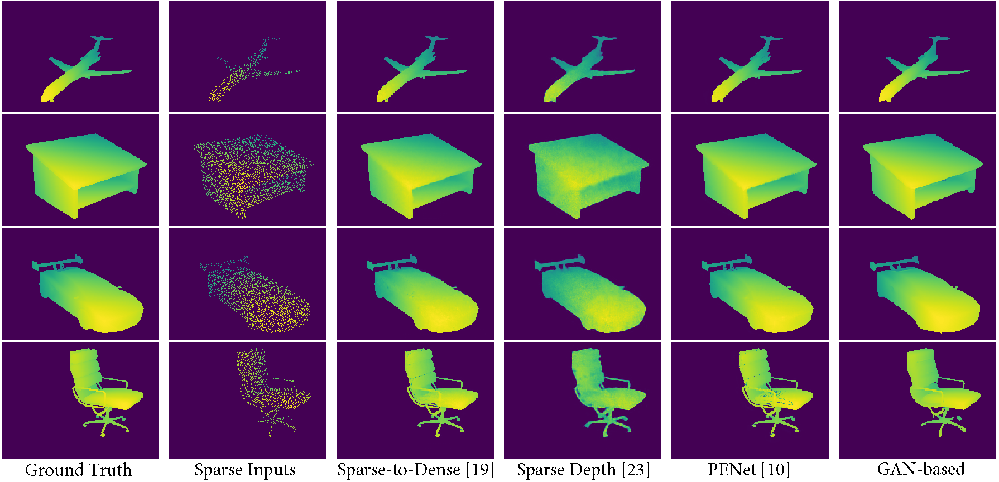

# Depth Completion GAN

This repo is the PyTorch implementation of our [ACM Multimedia'21](https://2021.acmmm.org/main-track-list) paper on [Sparse to Dense Depth Completion using a Generative Adversarial Network with Intelligent Sampling Strategies](https://dl.acm.org/doi/10.1145/3474085.3475688)

<p align="center">
	
</p>

## Requirements
The base environment(python 3.6) consists of:
```
pytorch == 1.3.1
torchvision == 0.4.2
tensorboard == 2.4.1
py-opencv == 3.4.2
numpy == 1.17.4
typing == 3.6.4
```

## Dataset
Primarily two datasets were used [ShapeNet](https://shapenet.org/) and [NYU_v2](https://cs.nyu.edu/~silberman/datasets/nyu_depth_v2.html)

## Training

In order to run training:
```bash
python train.py --gpus=0,1,2,3 --batch_size=8 --n_epochs=10 --residual_blocks=17 --decay_epoch=5 -n train_test
```
- -n --> give a name to the run
- Modify the val dataloader path with appropriate data directory
- Typically the directory has the following structure
```
    .
    ├── data.ShapeNetDepth
        ├── train
        |   ├── image_hr      #contains the ground truth
        |   ├── image_lr      #contains the saprse depth
        |   ├── meta_info.txt #contains the metadata of the directory
        ├── val
        |   ├── image_hr      #contains the ground truth
        |   ├── image_lr      #contains the saprse depth
        |   ├── meta_info.txt #contains the metadata of the directory
        ├── sample
        |   ├── image_hr      #contains the ground truth
        |   ├── image_lr      #contains the saprse depth
        |   ├── meta_info.txt #contains the metadata of the directory
```
- The image_hr and image_lr are the folder containing dense and sparse depth respectively
- The meta_info.txt contains the file names of these folders. Refer to misc/ folder for sample meta_info file
- The folder "sample" contains a few sparse samples. This is to track the model learning visually.
- The Dataset path needs to be hard coded within the script look at lines (170, 177, 183) in the train.py and line 264 in validate.py

### Resume from checkpoint
In order to resume from a checkpoint, you can use the following command:
```
python esrgan.py --gpus=0,1,2,3 --batch_size=8 --resume_epoch=1 --checkpoint_model_path=./logdir/train_test/saved_models --n_epochs=11 --residual_blocks=17  --decay_epoch=5 -n train_resume_test
```
- The "--resume_epoch" and "--checkpoint_model_path" are required for checkpoint resuming
- Typically the saved models are names as "generator_{}.pth" "discriminator_{}.pth" where {} contains the epoch to be resumed from
 
## Validation
You can run standalone validation if you have a trained model. For that the checkpoint model path has to have 2 files named generator_best.pth and discriminator_best.pth. You can invoke the validation script by:
```bash
python validate.py --gpus=0,1,2,3 --batch_size=8 --residual_blocks=17 --checkpoint_model=./logdir/train_test/saved_models/ -n val_test
```
## Misc
For convenience, some helping scripts have been provided in the misc\ folder
```
.
├── depthSamplingMP.py  #tutorial script for sparsifying dense depth
├── genMeta.py          #tutorial script for generating the meta data
├── meta_info.txt       #example meta_info file
```

## Citation
If you found the repository helpful, please cite using the following:
```
@inproceedings{10.1145/3474085.3475688,
author = {Khan, Md Fahim Faysal and Troncoso Aldas, Nelson Daniel and Kumar, Abhishek and Advani, Siddharth and Narayanan, Vijaykrishnan},
title = {Sparse to Dense Depth Completion Using a Generative Adversarial Network with Intelligent Sampling Strategies},
year = {2021},
isbn = {9781450386517},
publisher = {Association for Computing Machinery},
address = {New York, NY, USA},
url = {https://doi.org/10.1145/3474085.3475688},
doi = {10.1145/3474085.3475688},
booktitle = {Proceedings of the 29th ACM International Conference on Multimedia},
pages = {5528–5536},
numpages = {9},
keywords = {depth completion, gan, image compression, sensor sampling},
location = {Virtual Event, China},
series = {MM '21}
}
```

## Acknowledgement
This work was supported in part by National Science Foundation (NSF) SOPHIA (CCF-1822923) and Center for Brain-inspired Computing (C-BRIC) & Center for Research in Intelligent Storage and Processing in Memory (CRISP), two of the six centers in JUMP, a Semiconductor Research Corporation (SRC) program sponsored by DARPA.